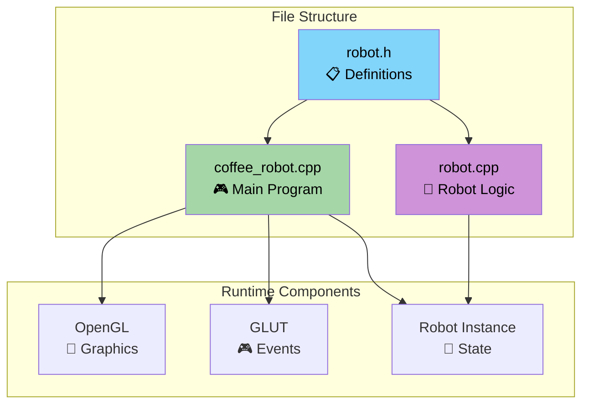
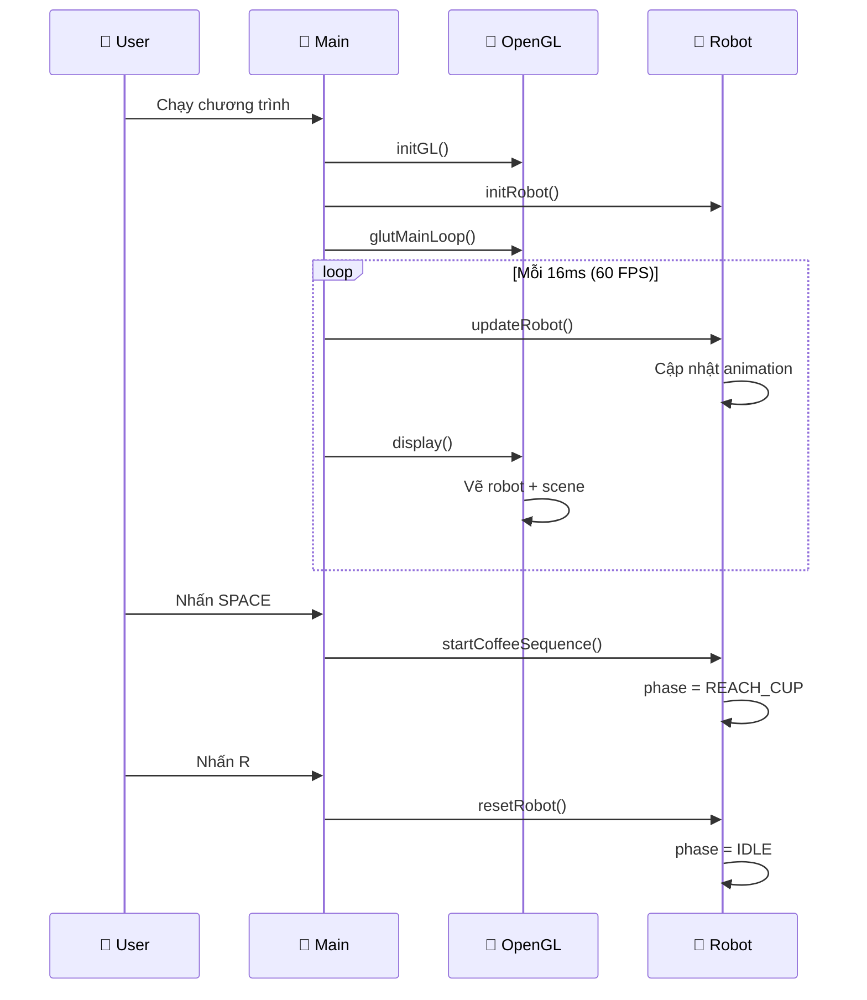
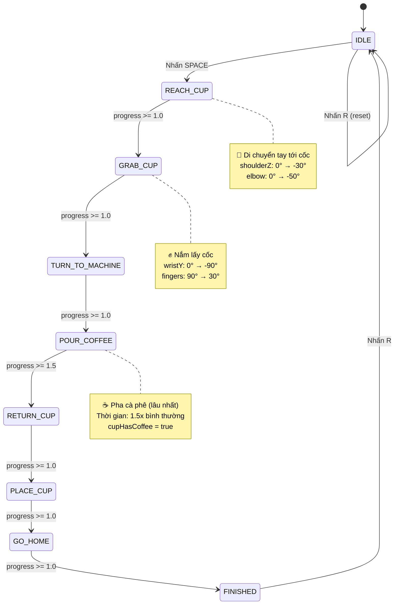
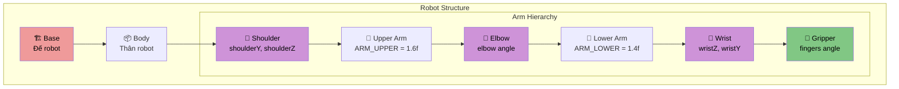
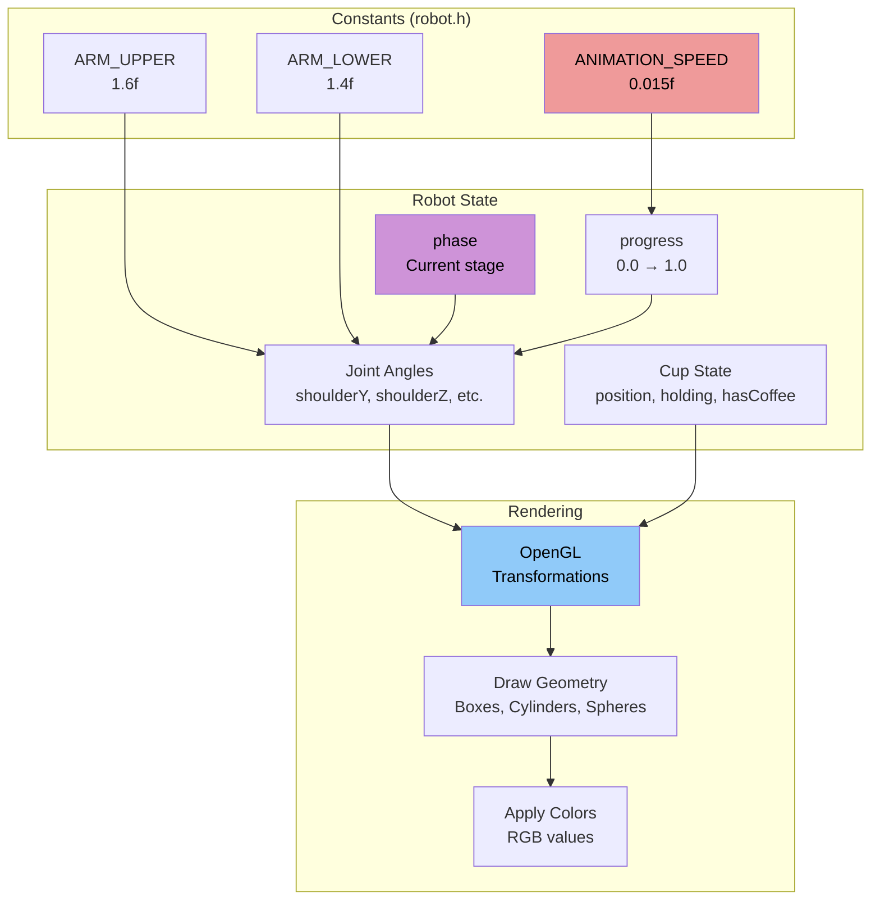

# 📊 SƠ ĐỒ TỔNG QUAN HỆ THỐNG

## 🎯 Mục đích
File này chứa các sơ đồ trực quan giúp hiểu cách hoạt động của hệ thống robot pha cà phê.

---

## 🏗️ Kiến trúc hệ thống



---

## 🔄 Luồng hoạt động chương trình



---

## 🎭 Các giai đoạn Robot (State Machine)



---

## 🤖 Cấu trúc Robot



---

## 🌍 Scene Layout

```mermaid
graph LR
    subgraph "3D Scene (Top View)"
        subgraph "Table Area"
            TABLE[📋 Table<br/>10×8×0.2]
            ROBOT[🤖 Robot<br/>(0, 1.1, 0)]
            CUP[☕ Cup<br/>(2.2, TABLE_Y+0.25, 0)]
            MACHINE[⚙️ Coffee Machine<br/>(-4, TABLE_Y+1.1, 0)]
        end
        
        subgraph "Camera System"
            CAM[📷 Camera<br/>Distance: 15.0f]
            ANGLE_X[🔄 AngleX<br/>Up/Down]
            ANGLE_Y[🔄 AngleY<br/>Left/Right]
        end
    end
    
    ROBOT -.-> CUP
    ROBOT -.-> MACHINE
    CAM --> ROBOT
    
    style ROBOT fill:#90caf9,color:#000000
    style CUP fill:#ffcc80,color:#000000
    style MACHINE fill:#ce93d8,color:#000000
    style CAM fill:#a5d6a7,color:#000000
```

---

## ⚡ Animation System

```mermaid
graph TB
    subgraph "Animation Pipeline"
        TIMER[⏰ Timer<br/>16ms = 60 FPS]
        UPDATE[🔄 updateRobot()]
        PROGRESS[📊 robot.progress += ANIMATION_SPEED]
        SMOOTH[✨ smooth(progress)]
        JOINTS[🦾 Update Joint Angles]
        DISPLAY[🎨 display()]
    end
    
    TIMER --> UPDATE
    UPDATE --> PROGRESS
    PROGRESS --> SMOOTH
    SMOOTH --> JOINTS
    JOINTS --> DISPLAY
    DISPLAY --> TIMER
    
    subgraph "Smooth Function"
        INPUT[Input: t (0.0 → 1.0)]
        FORMULA[Formula: t² × (3 - 2t)]
        OUTPUT[Output: Smooth curve]
    end
    
    SMOOTH --> INPUT
    INPUT --> FORMULA
    FORMULA --> OUTPUT
    
    style TIMER fill:#fff176,color:#000000
    style SMOOTH fill:#a5d6a7,color:#000000
    style JOINTS fill:#90caf9,color:#000000
```

---

## 🎮 User Interaction

```mermaid
graph LR
    subgraph "Input Events"
        SPACE[SPACE<br/>🚀 Start Coffee]
        R_KEY[R Key<br/>🔄 Reset Robot]
        ESC[ESC<br/>🚪 Exit Program]
        MOUSE[🖱️ Mouse Drag<br/>📷 Rotate Camera]
        ARROWS[⬆️⬇️ Arrow Keys<br/>🔍 Zoom In/Out]
    end
    
    subgraph "Robot Actions"
        START[startCoffeeSequence()]
        RESET[resetRobot()]
        EXIT[exit(0)]
        ROTATE[Update cameraAngleX/Y]
        ZOOM[Update cameraDistance]
    end
    
    SPACE --> START
    R_KEY --> RESET
    ESC --> EXIT
    MOUSE --> ROTATE
    ARROWS --> ZOOM
    
    style SPACE fill:#81c784,color:#000000
    style R_KEY fill:#ef9a9a,color:#000000
    style ESC fill:#ffcc02,color:#000000
    style MOUSE fill:#ce93d8,color:#000000
    style ARROWS fill:#4fc3f7,color:#000000
```

---

## 📊 Data Flow



---

## 🎯 **Cách sử dụng sơ đồ:**

1. **Bắt đầu với "Kiến trúc hệ thống"** - Hiểu cấu trúc file
2. **Xem "Luồng hoạt động"** - Hiểu cách chương trình chạy
3. **Nghiên cứu "State Machine"** - Hiểu các giai đoạn robot
4. **Tham khảo "Animation System"** - Hiểu cách animation hoạt động
5. **Sử dụng "Data Flow"** - Hiểu cách dữ liệu di chuyển trong hệ thống 