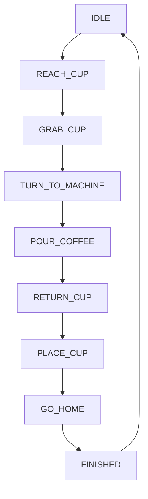

# 🚀 HƯỚNG DẪN TỔNG HỢP HỆ THỐNG ROBOT SIMULATION

## 📋 Mục lục
- [Tổng quan hệ thống](#tổng-quan-hệ-thống)
- [Kiến trúc 3 file chính](#kiến-trúc-3-file-chính)
- [Luồng hoạt động](#luồng-hoạt-động)
- [robot.h - Định nghĩa và cấu trúc](#roboth---định-nghĩa-và-cấu-trúc)
- [robot_simple.cpp - Logic và animation](#robot_simplecpp---logic-và-animation)
- [coffee_robot.cpp - UI và OpenGL](#coffee_robotcpp---ui-và-opengl)
- [Cách thay đổi vị trí và chuyển động](#cách-thay-đổi-vị-trí-và-chuyển-động)
- [Cách thay đổi giao diện và camera](#cách-thay-đổi-giao-diện-và-camera)
- [Tùy chỉnh toàn diện](#tùy-chỉnh-toàn-diện)
- [Workflow phát triển](#workflow-phát-triển)
- [Troubleshooting toàn hệ thống](#troubleshooting-toàn-hệ-thống)

## 🎯 Tổng quan hệ thống

### 🏗️ Kiến trúc MVC (Model-View-Controller)
```
robot.h           ←→  robot_simple.cpp  ←→  coffee_robot.cpp
   |                        |                      |
[MODEL]               [CONTROLLER]             [VIEW]
Cấu trúc dữ liệu      Logic & Animation       UI & Rendering
Định nghĩa           Implementation           OpenGL Display
```

### 🔄 Mối quan hệ giữa các file:
1. **robot.h** → Định nghĩa interface, structs, enums, constants
2. **robot_simple.cpp** → Implementation logic, kinematics, animation
3. **coffee_robot.cpp** → Main application, OpenGL setup, user interaction

### 📦 Responsibility của từng file:

| File | Trách nhiệm | Nội dung chính |
|------|-------------|----------------|
| **robot.h** | Data Model | Structs, Enums, Constants, Function declarations |
| **robot_simple.cpp** | Business Logic | Animation phases, Robot movements, Kinematics |
| **coffee_robot.cpp** | Presentation Layer | OpenGL rendering, Camera, Input handling |

## 🏗️ Kiến trúc 3 file chính

### 📄 1. robot.h - Header/Interface Layer
```cpp
#ifndef ROBOT_H
#define ROBOT_H

// ============= DEPENDENCIES =============
#include <GL/gl.h>      // OpenGL core
#include <GL/glu.h>     // OpenGL utilities  
#include <GL/glut.h>    // GLUT windowing
#include <cmath>        // Math functions

// ============= CONSTANTS =============
const float ANIMATION_SPEED = 0.015f;  // Tốc độ chuyển động
const float ARM_UPPER = 1.6f;          // Chiều dài cánh tay trên
const float ARM_LOWER = 1.4f;          // Chiều dài cánh tay dưới
const float CUP_SIZE = 0.25f;          // Kích thước cốc
const float TABLE_Y = 0.1f;            // Độ cao bàn

// ============= ENUMS =============
enum RobotPhase {
    IDLE = 0, REACH_CUP, GRAB_CUP, TURN_TO_MACHINE,
    POUR_COFFEE, RETURN_CUP, PLACE_CUP, GO_HOME, FINISHED
};

// ============= STRUCTS =============
struct Robot {
    // Kinematic joints
    float shoulderY, shoulderZ, elbow, wristZ, wristY, fingers, body;
    
    // Animation state
    RobotPhase phase;
    float progress;
    bool moving;
    
    // Object interaction
    float cupX, cupY, cupZ;
    bool holdingCup, cupHasCoffee;
};

// ============= FUNCTION DECLARATIONS =============
void initRobot();
void updateRobot();
void startCoffeeSequence();
void resetRobot();
void drawRobot();
void drawScene();

// ============= GLOBAL INSTANCE =============
extern Robot robot;

#endif
```

**🎯 Mục đích:** Định nghĩa "contract" cho toàn bộ hệ thống. Mọi thay đổi ở đây ảnh hưởng đến cả system.

### 🔧 2. robot_simple.cpp - Implementation/Logic Layer
```cpp
#include "robot.h"
#include <cstdio>

// ============= GLOBAL INSTANCE =============
Robot robot;  // Định nghĩa thực tế của biến global

// ============= ANIMATION UTILITIES =============
float smooth(float t) {
    return t * t * (3.0f - 2.0f * t);  // Ease in/out curve
}

// ============= ROBOT CONTROL FUNCTIONS =============
void initRobot() {
    // Khởi tạo tất cả joint angles về 0
    robot.shoulderY = robot.shoulderZ = robot.elbow = 0.0f;
    robot.wristZ = robot.wristY = 0.0f;
    robot.body = 0.0f;
    robot.fingers = 90.0f;  // Gripper mở
    
    // Reset animation state
    robot.phase = IDLE;
    robot.progress = 0.0f;
    robot.moving = false;
    
    // Đặt cốc trên bàn
    robot.cupX = 2.2f;
    robot.cupY = TABLE_Y + 0.25f;
    robot.cupZ = 0.0f;
    robot.holdingCup = false;
    robot.cupHasCoffee = false;
}

void updateRobot() {
    if (!robot.moving) return;
    
    robot.progress += ANIMATION_SPEED;
    float s = smooth(robot.progress);
    
    switch (robot.phase) {
        case REACH_CUP:
            robot.shoulderZ = s * -30.0f;   // Hạ vai
            robot.elbow = s * -50.0f;       // Gập khuỷu
            robot.wristZ = s * 40.0f;       // Nâng cổ tay
            // ... transition logic
            break;
            
        case GRAB_CUP:
            robot.wristY = s * -90.0f;      // Xoay gripper
            // ... grip logic with timing
            break;
            
        // ... other phases
    }
}

// ============= RENDERING FUNCTIONS =============
void drawRobot() {
    // Forward kinematics implementation
    // Transform từ base -> shoulder -> elbow -> wrist -> gripper
}

void drawScene() {
    drawTable();
    drawCoffeeMachine();
    drawCup();
}
```

**🎯 Mục đích:** Implement logic robot, animation system, forward kinematics, rendering.

### 🖼️ 3. coffee_robot.cpp - Application/UI Layer
```cpp
#include "robot.h"
#include <iostream>

// ============= CAMERA GLOBALS =============
float cameraAngleX = -25.0f;
float cameraAngleY = 45.0f;
float cameraDistance = 15.0f;

// ============= OPENGL SETUP =============
void initGL() {
    glEnable(GL_DEPTH_TEST | GL_LIGHTING | GL_LIGHT0);
    
    GLfloat lightPos[] = {5.0f, 10.0f, 5.0f, 1.0f};
    glLightfv(GL_LIGHT0, GL_POSITION, lightPos);
    
    glClearColor(0.5f, 0.7f, 1.0f, 1.0f);  // Sky blue
    
    initRobot();  // Khởi tạo robot từ robot_simple.cpp
}

// ============= MAIN RENDERING LOOP =============
void display() {
    glClear(GL_COLOR_BUFFER_BIT | GL_DEPTH_BUFFER_BIT);
    glLoadIdentity();
    
    // Camera setup
    glTranslatef(0.0f, 0.0f, -cameraDistance);
    glRotatef(cameraAngleX, 1.0f, 0.0f, 0.0f);
    glRotatef(cameraAngleY, 0.0f, 1.0f, 0.0f);
    
    // Draw everything (calls robot_simple.cpp functions)
    drawScene();
    drawRobot();
    
    // UI overlay
    // ... status text rendering
    
    glutSwapBuffers();
}

// ============= INPUT HANDLING =============
void keyboard(unsigned char key, int x, int y) {
    switch (key) {
        case ' ':
            startCoffeeSequence();  // Call robot_simple.cpp
            break;
        case 'r':
            resetRobot();           // Call robot_simple.cpp
            break;
    }
}

// ============= ANIMATION TIMER =============
void timer(int value) {
    updateRobot();              // Call robot_simple.cpp
    glutPostRedisplay();
    glutTimerFunc(16, timer, 0);
}

// ============= MAIN ENTRY POINT =============
int main(int argc, char** argv) {
    glutInit(&argc, argv);
    glutCreateWindow("Robot Coffee Maker");
    
    initGL();
    
    glutDisplayFunc(display);
    glutKeyboardFunc(keyboard);
    glutTimerFunc(16, timer, 0);
    
    glutMainLoop();
    return 0;
}
```

**🎯 Mục đích:** Quản lý cửa sổ, input, camera, OpenGL context, và điều phối calls tới robot logic.

## 🔄 Luồng hoạt động

### 📱 Application Startup Flow:
```mermaid
graph TD
    A[main()] --> B[glutInit()]
    B --> C[initGL()]
    C --> D[initRobot()]
    D --> E[glutMainLoop()]
    E --> F[timer() every 16ms]
    F --> G[updateRobot()]
    G --> H[glutPostRedisplay()]
    H --> I[display()]
    I --> J[drawScene() + drawRobot()]
    J --> F
```

### 🎮 User Interaction Flow:
```mermaid
graph TD
    A[User presses SPACE] --> B[keyboard()]
    B --> C[startCoffeeSequence()]
    C --> D[robot.moving = true]
    D --> E[robot.phase = REACH_CUP]
    E --> F[timer() calls updateRobot()]
    F --> G[Update joint angles based on phase]
    G --> H[Check if phase complete]
    H --> I{Progress >= 1.0?}
    I -->|Yes| J[Move to next phase]
    I -->|No| K[Continue current phase]
    J --> F
    K --> F
```

### 🤖 Robot Animation Flow:


## 🤖 robot.h - Định nghĩa và cấu trúc

### 🔧 Constants - Điều chỉnh hành vi toàn cục

```cpp
const float ANIMATION_SPEED = 0.015f;
```
**📊 Ảnh hưởng:** Tốc độ của TẤT CẢ animations
- **Tăng** (0.03f): Robot di chuyển nhanh gấp đôi
- **Giảm** (0.008f): Robot di chuyển chậm hơn, mượt mà hơn

```cpp
const float ARM_UPPER = 1.6f;
const float ARM_LOWER = 1.4f;
```
**📊 Ảnh hưởng:** Tầm với và khả năng di chuyển
- **Tăng ARM_UPPER** (2.0f): Robot với xa hơn, có thể lấy cốc ở xa
- **Giảm ARM_LOWER** (1.0f): Robot ít linh hoạt, chuyển động cứng nhắc

```cpp
const float TABLE_Y = 0.1f;
```
**📊 Ảnh hưởng:** Độ cao bàn và vị trí tất cả objects
- **Tăng** (0.5f): Bàn cao hơn, robot phải duỗi tay xuống nhiều hơn
- **Giảm** (0.0f): Bàn ở mặt đất

### 🎭 RobotPhase Enum - State Machine

```cpp
enum RobotPhase {
    IDLE = 0,           // 🛑 Chờ lệnh
    REACH_CUP,          // 🫴 Duỗi tay tới cốc
    GRAB_CUP,           // 🤏 Cầm lấy cốc
    TURN_TO_MACHINE,    // 🔄 Xoay về máy pha
    POUR_COFFEE,        // ☕ Pha cà phê
    RETURN_CUP,         // ↩️ Quay về bàn
    PLACE_CUP,          // 📍 Đặt cốc xuống
    GO_HOME,            // 🏠 Về vị trí ban đầu
    FINISHED            // ✅ Hoàn thành
};
```

**🔧 Cách thêm phase mới:**
```cpp
enum RobotPhase {
    // ... existing phases
    WAVE_HELLO,         // 👋 Vẫy tay chào
    CLEAN_GRIPPER,      // 🧼 Làm sạch gripper
    // ... continue
};
```

### 🤖 Robot Struct - Trạng thái hoàn chỉnh

```cpp
struct Robot {
    // ===== KINEMATICS (6-DOF) =====
    float shoulderY;    // Xoay vai ngang (-180° to 180°)
    float shoulderZ;    // Xoay vai dọc (-90° to 90°)
    float elbow;        // Gập khuỷu tay (0° to 180°)
    float wristZ;       // Gập cổ tay (-90° to 90°)
    float wristY;       // Xoắn cổ tay (-180° to 180°)
    float fingers;      // Gripper (0=đóng to 90=mở)
    float body;         // Xoay thân (-180° to 180°)
    
    // ===== ANIMATION STATE =====
    RobotPhase phase;   // Pha hiện tại
    float progress;     // Tiến độ (0.0 to 1.0)
    bool moving;        // Có đang chuyển động không
    
    // ===== OBJECT INTERACTION =====
    float cupX, cupY, cupZ;  // Vị trí cốc
    bool holdingCup;         // Có đang cầm cốc không
    bool cupHasCoffee;       // Cốc có cà phê không
};
```

## 🎬 robot_simple.cpp - Logic và animation

### 🎯 Hàm cốt lõi: updateRobot()

Đây là **tim của hệ thống**, được gọi 60 lần/giây để cập nhật robot:

```cpp
void updateRobot() {
    if (!robot.moving) return;  // Skip nếu robot đang idle
    
    robot.progress += ANIMATION_SPEED;  // Tăng tiến độ
    float t = robot.progress;           // Raw progress
    float s = smooth(t);                // Smoothed progress
    
    switch (robot.phase) {
        case REACH_CUP:
            // Interpolate từ pose hiện tại đến pose đích
            robot.shoulderZ = s * -30.0f;  // 0° → -30°
            robot.elbow = s * -50.0f;      // 0° → -50°
            robot.wristZ = s * 40.0f;      // 0° → 40°
            robot.shoulderY = s * 10.0f;   // 0° → 10°
            
            if (robot.progress >= 1.0f) {
                robot.phase = GRAB_CUP;    // Chuyển phase
                robot.progress = 0.0f;     // Reset progress
            }
            break;
            
        // ... other phases
    }
}
```

### 🎨 Animation Curve: smooth()

```cpp
float smooth(float t) {
    return t * t * (3.0f - 2.0f * t);
}
```

**📈 So sánh curves:**
- **Linear**: `t` - Chuyển động đều đặn, cơ học
- **Ease-in**: `t*t` - Bắt đầu chậm, tăng tốc
- **Ease-out**: `1-(1-t)²` - Bắt đầu nhanh, chậm lại
- **Ease-in-out**: `t²(3-2t)` - Chậm → nhanh → chậm (tự nhiên nhất)

### 🔧 Forward Kinematics trong drawRobot()

```cpp
void drawRobotArm() {
    glPushMatrix();
    
    // 1. Di chuyển đến vai
    glTranslatef(0, 1, 0);
    glRotatef(robot.shoulderY, 0, 1, 0);  // Xoay ngang
    glRotatef(robot.shoulderZ, 0, 0, 1);  // Xoay dọc
    
    // 2. Vẽ cánh tay trên
    glTranslatef(ARM_UPPER/2, 0, 0);
    drawBox(ARM_UPPER, 0.5f, 0.5f);
    
    // 3. Di chuyển đến khuỷu tay
    glTranslatef(ARM_UPPER/2, 0, 0);
    glRotatef(robot.elbow, 0, 0, 1);      // Gập khuỷu
    
    // 4. Vẽ cánh tay dưới
    glTranslatef(ARM_LOWER/2, 0, 0);
    drawBox(ARM_LOWER, 0.4f, 0.4f);
    
    // 5. Di chuyển đến cổ tay
    glTranslatef(ARM_LOWER/2, 0, 0);
    glRotatef(robot.wristZ, 0, 0, 1);     // Gập cổ tay
    glRotatef(robot.wristY, 0, 1, 0);     // Xoắn cổ tay
    
    // 6. Vẽ gripper
    drawGripper();
    
    glPopMatrix();
}
```

**🔗 Transformation Chain:**
```
Base → Body(bodyAngle) → Shoulder(shoulderY,Z) → UpperArm → Elbow(elbow) → LowerArm → Wrist(wristZ,Y) → Gripper(fingers)
```

## 🖼️ coffee_robot.cpp - UI và OpenGL

### 📷 Camera System

```cpp
// Camera state
float cameraAngleX = -25.0f;  // Pitch (lên/xuống)
float cameraAngleY = 45.0f;   // Yaw (trái/phải)  
float cameraDistance = 15.0f; // Zoom

void display() {
    // Camera transformation
    glTranslatef(0, 0, -cameraDistance);      // Move back
    glRotatef(cameraAngleX, 1, 0, 0);         // Rotate up/down
    glRotatef(cameraAngleY, 0, 1, 0);         // Rotate left/right
    
    // Scene rendering
    drawScene();  // From robot_simple.cpp
    drawRobot();  // From robot_simple.cpp
}
```

### 💡 Lighting Setup

```cpp
void initGL() {
    // Enable OpenGL features
    glEnable(GL_DEPTH_TEST);    // Z-buffer
    glEnable(GL_LIGHTING);      // Lighting system
    glEnable(GL_LIGHT0);        // Light #0
    
    // Light properties
    GLfloat lightPos[] = {5.0f, 10.0f, 5.0f, 1.0f};     // Position
    GLfloat lightColor[] = {1.0f, 1.0f, 1.0f, 1.0f};    // White
    GLfloat ambient[] = {0.3f, 0.3f, 0.3f, 1.0f};       // Ambient
    
    glLightfv(GL_LIGHT0, GL_POSITION, lightPos);
    glLightfv(GL_LIGHT0, GL_DIFFUSE, lightColor);
    glLightfv(GL_LIGHT0, GL_AMBIENT, ambient);
}
```

### ⏰ Animation Timer

```cpp
void timer(int value) {
    updateRobot();              // Update robot (robot_simple.cpp)
    glutPostRedisplay();        // Trigger redraw
    glutTimerFunc(16, timer, 0); // Schedule next frame (60 FPS)
}
```

## 🎮 Cách thay đổi vị trí và chuyển động

### 1. 🚀 Thay đổi tốc độ toàn cục

**📍 File: robot.h**
```cpp
const float ANIMATION_SPEED = 0.03f;   // Nhanh gấp đôi
const float ANIMATION_SPEED = 0.008f;  // Chậm hơn gần 2 lần
```

### 2. 🦾 Thay đổi pose cụ thể trong từng phase

**📍 File: robot_simple.cpp → updateRobot()**

#### REACH_CUP Phase:
```cpp
case REACH_CUP:
    // Original
    robot.shoulderZ = s * -30.0f;
    robot.elbow = s * -50.0f;
    robot.wristZ = s * 40.0f;
    
    // Modified - robot duỗi xa hơn
    robot.shoulderZ = s * -45.0f;   // Hạ vai sâu hơn
    robot.elbow = s * -70.0f;       // Gập khuỷu nhiều hơn
    robot.wristZ = s * 60.0f;       // Nâng cổ tay cao hơn
    robot.shoulderY = s * 20.0f;    // Xoay vai nhiều hơn
    break;
```

#### GRAB_CUP Phase:
```cpp
case GRAB_CUP:
    // Original timing
    if (s < 0.5f) {
        robot.fingers = 90.0f;  // Mở
    } else {
        robot.fingers = 90.0f - (s-0.5f)/0.5f * 60.0f;  // Đóng
    }
    
    // Modified - grip chậm hơn và chặt hơn
    if (s < 0.7f) {
        robot.fingers = 90.0f;  // Mở lâu hơn
    } else {
        robot.fingers = 90.0f - (s-0.7f)/0.3f * 75.0f;  // Đóng chặt hơn
    }
    break;
```

### 3. 📍 Thay đổi vị trí cốc và môi trường

**📍 File: robot_simple.cpp → initRobot()**
```cpp
void initRobot() {
    // Vị trí cốc ban đầu
    robot.cupX = 1.8f;   // Gần robot hơn (dễ với tới)
    robot.cupY = TABLE_Y + 0.3f;  // Cao hơn một chút
    robot.cupZ = -0.5f;  // Về phía sau robot
}
```

**📍 File: robot_simple.cpp → drawCoffeeMachine()**
```cpp
void drawCoffeeMachine() {
    glTranslatef(-3.0f, TABLE_Y + 1.1f, 1.0f);  // Di chuyển vị trí máy
    // Gần robot hơn, về phía trước
}
```

### 4. 🏠 Thay đổi home position

**📍 File: robot_simple.cpp → initRobot()**
```cpp
void initRobot() {
    // Home pose mới - robot "nghỉ"
    robot.shoulderY = 0.0f;
    robot.shoulderZ = -20.0f;   // Hạ vai xuống
    robot.elbow = 90.0f;        // Gập khuỷu 90°
    robot.wristZ = -30.0f;      // Cổ tay hướng xuống
    robot.wristY = 0.0f;
    robot.fingers = 45.0f;      // Gripper nửa mở
    robot.body = 0.0f;
}
```

### 5. ➕ Thêm phase mới

**📍 File: robot.h**
```cpp
enum RobotPhase {
    IDLE = 0,
    WAVE_HELLO,        // 👋 Phase mới: vẫy tay chào
    REACH_CUP,
    // ... rest of phases
};
```

**📍 File: robot_simple.cpp → updateRobot()**
```cpp
case WAVE_HELLO:
    robot.shoulderZ = 80.0f + sin(robot.progress * 10.0f) * 10.0f;  // Vẫy
    robot.elbow = 45.0f;
    robot.wristZ = 0.0f;
    robot.fingers = 90.0f;
    
    if (robot.progress >= 3.0f) {  // Vẫy trong 3 chu kỳ
        robot.phase = REACH_CUP;
        robot.progress = 0.0f;
    }
    break;
```

## 📷 Cách thay đổi giao diện và camera

### 1. 🎥 Camera presets

**📍 File: coffee_robot.cpp**
```cpp
// Top-down view
void setTopDownView() {
    cameraAngleX = -90.0f;
    cameraAngleY = 0.0f;
    cameraDistance = 20.0f;
}

// Side view
void setSideView() {
    cameraAngleX = 0.0f;
    cameraAngleY = 90.0f;
    cameraDistance = 15.0f;
}

// 45-degree isometric
void setIsometricView() {
    cameraAngleX = -30.0f;
    cameraAngleY = 45.0f;
    cameraDistance = 18.0f;
}

// Thêm vào keyboard()
case '1': setTopDownView(); break;
case '2': setSideView(); break;
case '3': setIsometricView(); break;
```

### 2. 💡 Lighting themes

**📍 File: coffee_robot.cpp → initGL()**
```cpp
// Warm lighting (coffee shop)
void setupWarmLighting() {
    GLfloat lightColor[] = {1.0f, 0.8f, 0.6f, 1.0f};  // Warm white
    GLfloat ambient[] = {0.4f, 0.3f, 0.2f, 1.0f};     // Warm ambient
    glClearColor(0.3f, 0.2f, 0.1f, 1.0f);             // Dark brown background
}

// Cool lighting (high-tech)
void setupCoolLighting() {
    GLfloat lightColor[] = {0.8f, 0.9f, 1.0f, 1.0f};  // Cool white
    GLfloat ambient[] = {0.1f, 0.2f, 0.3f, 1.0f};     // Cool ambient
    glClearColor(0.1f, 0.1f, 0.2f, 1.0f);             // Dark blue background
}

// Dramatic lighting
void setupDramaticLighting() {
    GLfloat lightPos[] = {-5.0f, 15.0f, 10.0f, 1.0f}; // Side lighting
    GLfloat lightColor[] = {1.0f, 1.0f, 1.0f, 1.0f};
    GLfloat ambient[] = {0.1f, 0.1f, 0.1f, 1.0f};     // Very dark ambient
    glClearColor(0.0f, 0.0f, 0.0f, 1.0f);             // Black background
}
```

### 3. 🎨 UI themes

**📍 File: coffee_robot.cpp → display()**
```cpp
// Dark theme status text
void drawDarkThemeUI() {
    // Dark background
    glColor4f(0.1f, 0.1f, 0.1f, 0.8f);
    // ... draw background
    
    // Bright text
    glColor3f(0.0f, 1.0f, 0.5f);  // Green text
    // ... draw text
}

// Retro theme
void drawRetroThemeUI() {
    // Orange background
    glColor4f(1.0f, 0.5f, 0.0f, 0.6f);
    
    // Yellow text
    glColor3f(1.0f, 1.0f, 0.0f);
    
    // Larger font
    glutBitmapCharacter(GLUT_BITMAP_TIMES_ROMAN_24, currentText[i]);
}
```

## 🎯 Tùy chỉnh toàn diện

### 🚀 Ví dụ 1: Robot công nghiệp nhanh

**📍 Thay đổi nhiều file:**

**robot.h:**
```cpp
const float ANIMATION_SPEED = 0.05f;  // Siêu nhanh
const float ARM_UPPER = 2.0f;         // Cánh tay dài
const float ARM_LOWER = 1.8f;
```

**robot_simple.cpp → updateRobot():**
```cpp
case REACH_CUP:
    // Sharp, robotic movements
    robot.shoulderZ = t * -40.0f;  // Không dùng smooth()
    robot.elbow = t * -80.0f;      // Chuyển động cứng nhắc
    robot.wristZ = t * 50.0f;
    break;
```

**coffee_robot.cpp:**
```cpp
// High-tech UI
glClearColor(0.0f, 0.0f, 0.1f, 1.0f);  // Dark blue
// Cool lighting setup
```

### 🐌 Ví dụ 2: Robot gia đình chậm và êm ái

**robot.h:**
```cpp
const float ANIMATION_SPEED = 0.005f;  // Rất chậm
const float ARM_UPPER = 1.4f;          // Nhỏ gọn
const float ARM_LOWER = 1.2f;
```

**robot_simple.cpp:**
```cpp
// Super smooth curve
float extraSmooth(float t) {
    return t * t * t * (10.0f + t * (-15.0f + 6.0f * t));
}

case REACH_CUP:
    float es = extraSmooth(robot.progress);
    robot.shoulderZ = es * -25.0f;  // Gentle movements
    robot.elbow = es * -40.0f;
    robot.wristZ = es * 30.0f;
    break;
```

**coffee_robot.cpp:**
```cpp
// Warm, cozy lighting
setupWarmLighting();
// Soft camera movement
cameraAngleY += 0.1f;  // Slow auto-rotate
```

### 🌈 Ví dụ 3: Demo mode với nhiều hiệu ứng

**robot_simple.cpp:**
```cpp
// Rainbow robot
void drawRobotArm() {
    // Base - red
    glColor3f(1.0f, 0.0f, 0.0f);
    drawBase();
    
    // Upper arm - green
    glColor3f(0.0f, 1.0f, 0.0f);
    drawUpperArm();
    
    // Lower arm - blue
    glColor3f(0.0f, 0.0f, 1.0f);
    drawLowerArm();
    
    // Gripper - yellow
    glColor3f(1.0f, 1.0f, 0.0f);
    drawGripper();
}

// Glowing cup
void drawCup() {
    if (robot.cupHasCoffee) {
        // Glow effect
        glColor3f(1.0f, 0.5f, 0.0f);  // Orange glow
        glutSolidSphere(CUP_SIZE * 1.2f, 20, 20);
    }
    // ... normal cup
}
```

**coffee_robot.cpp:**
```cpp
// Cinematic camera
void cinematicCamera() {
    static float time = 0.0f;
    time += 0.02f;
    
    cameraDistance = 15.0f + sin(time) * 5.0f;  // Breathing zoom
    cameraAngleY += sin(time * 0.5f) * 0.5f;    // Gentle sway
    cameraAngleX = -25.0f + cos(time * 0.3f) * 10.0f; // Up/down
}

// Call in timer()
cinematicCamera();
```

## 🛠️ Workflow phát triển

### 📝 Quy trình thay đổi từng loại feature:

#### 1. 🎭 Thêm animation phase mới:
1. **robot.h** → Thêm enum trong `RobotPhase`
2. **robot_simple.cpp** → Thêm case trong `updateRobot()`
3. **coffee_robot.cpp** → Thêm text trong `statusText[]`

#### 2. 🔧 Thay đổi kinematics:
1. **robot.h** → Thay đổi constants (ARM_*, CUP_SIZE, etc.)
2. **robot_simple.cpp** → Điều chỉnh target angles trong phases
3. **robot_simple.cpp** → Cập nhật `drawRobot()` nếu cần

#### 3. 🎨 Thay đổi visual:
1. **robot_simple.cpp** → Modify drawing functions
2. **coffee_robot.cpp** → Adjust lighting/camera
3. **coffee_robot.cpp** → Update UI colors/text

#### 4. 🎮 Thêm controls:
1. **coffee_robot.cpp** → Add cases in `keyboard()`
2. **robot_simple.cpp** → Add corresponding control functions
3. **coffee_robot.cpp** → Update instructions text

### 🔄 Testing workflow:
```bash
# Compile
make

# Test basic functionality
./coffee_robot
# Press SPACE → Check all phases execute
# Press R → Check reset works
# Mouse drag → Check camera works

# Test modifications
# Modify constants in robot.h
make clean && make
./coffee_robot
# Verify changes take effect
```

## ⚠️ Troubleshooting toàn hệ thống

### 🚨 Compile-time errors:

#### 1. "undefined reference to robot"
```bash
# Cause: robot.h declares extern Robot robot, but no definition
# Fix: Make sure robot_simple.cpp has Robot robot; at global scope
```

#### 2. "GL/gl.h not found"
```bash
# Ubuntu/Debian
sudo apt-get install freeglut3-dev

# CentOS/RHEL  
sudo yum install freeglut-devel

# macOS
brew install freeglut
```

#### 3. Linker errors
```bash
# Make sure Makefile links OpenGL libraries
g++ -o coffee_robot *.cpp -lGL -lGLU -lglut
```

### 🎮 Runtime issues:

#### 1. Robot không chuyển động
```cpp
// Debug checklist:
printf("Robot moving: %s\n", robot.moving ? "Yes" : "No");
printf("Robot phase: %d\n", robot.phase);
printf("Animation speed: %f\n", ANIMATION_SPEED);

// Common fixes:
- Ensure startCoffeeSequence() sets robot.moving = true
- Check ANIMATION_SPEED > 0
- Verify timer() calls updateRobot()
```

#### 2. Robot không với tới cốc
```cpp
// Debug positions:
printf("Cup position: (%.1f, %.1f, %.1f)\n", robot.cupX, robot.cupY, robot.cupZ);
printf("Robot reach: ARM_UPPER=%.1f + ARM_LOWER=%.1f = %.1f\n", 
       ARM_UPPER, ARM_LOWER, ARM_UPPER + ARM_LOWER);

// Fixes:
- Move cup closer: robot.cupX = 1.5f;
- Increase arm length: ARM_UPPER = 2.0f;
- Adjust shoulder angle: robot.shoulderY = s * 20.0f;
```

#### 3. Animation không mượt
```cpp
// Performance debug:
static int frameCount = 0;
frameCount++;
if (frameCount % 60 == 0) {
    printf("60 frames completed\n");
}

// Fixes:
- Increase timer delay: glutTimerFunc(33, timer, 0); // 30 FPS
- Simplify rendering: Reduce polygon count
- Use smooth() function: float s = smooth(robot.progress);
```

#### 4. Camera không phản hồi
```cpp
// Debug mouse:
printf("Mouse pressed: %s, pos: (%d, %d)\n", 
       mousePressed ? "Yes" : "No", lastMouseX, lastMouseY);

// Fixes:
- Check glutMotionFunc(mouseMotion) is registered
- Verify mouse() sets mousePressed = true
- Ensure glutPostRedisplay() is called
```

#### 5. Màn hình đen
```cpp
// Debug OpenGL:
GLenum error = glGetError();
if (error != GL_NO_ERROR) {
    printf("OpenGL error: %d\n", error);
}

// Common fixes:
- Check lighting setup: glEnable(GL_LIGHT0)
- Verify camera distance: cameraDistance = 15.0f
- Ensure glClear() and glutSwapBuffers() are called
```

### 📊 Performance optimization:

```cpp
// 1. Reduce rendering complexity
const int SPHERE_SEGMENTS = 10;  // Instead of 20
const int CYLINDER_SEGMENTS = 12; // Instead of 20

// 2. Skip unnecessary updates
void updateRobot() {
    if (!robot.moving) return;  // Early exit
    // ... rest of function
}

// 3. Cache expensive calculations
static float lastProgress = -1.0f;
if (robot.progress == lastProgress) return;
lastProgress = robot.progress;
```

---

## 🎯 Kết luận

Hệ thống robot simulation này được thiết kế theo kiến trúc **modular và scalable**:

- **robot.h**: Interface layer - thay đổi ở đây ảnh hưởng toàn bộ hệ thống
- **robot_simple.cpp**: Business logic - trái tim của animation và kinematics  
- **coffee_robot.cpp**: Presentation layer - UI, camera, và user interaction

### 🚀 Để phát triển thêm:
1. **Thêm sensors**: Collision detection, distance sensors
2. **Inverse kinematics**: Điều khiển endpoint position
3. **Path planning**: Tránh vật cản, tối ưu đường đi
4. **Multiple robots**: Phối hợp nhiều robot
5. **Physics simulation**: Realistic gravity, inertia

### 📚 Tài liệu tham khảo:
- [OpenGL Red Book](https://www.opengl.org/documentation/red_book/)
- [Robot Kinematics](https://en.wikipedia.org/wiki/Robot_kinematics)
- [Computer Graphics Principles](https://www.cs.cmu.edu/~graphics/)

---
📝 **Ghi chú**: Đây là tài liệu master cho toàn bộ hệ thống. Cập nhật khi có thay đổi lớn trong architecture. 